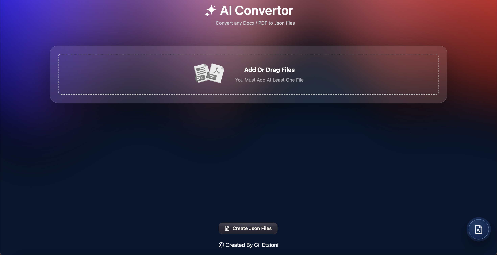
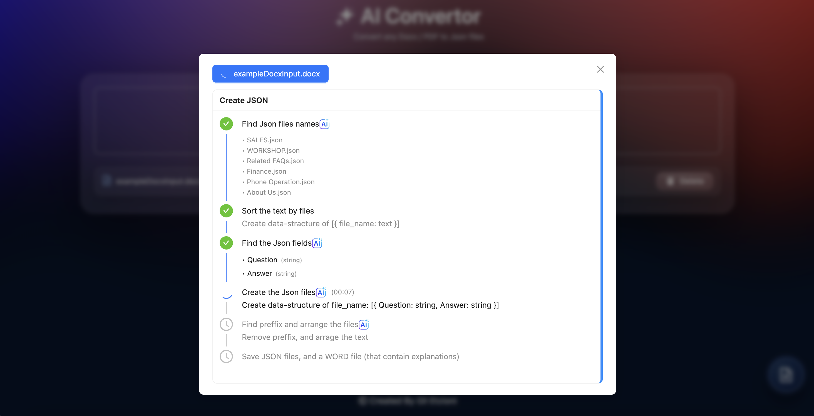

**Introduction:**

- The program gets `docx` files (one or more) and returns `json`  files.
- The backend use four AI agents, with:
  - schema validation.
  - error handling.
  - automated cleanup.
- The code can get any docx file, and convert it into json files.

**Front-End:**

**Back-End:**

**UI:**

